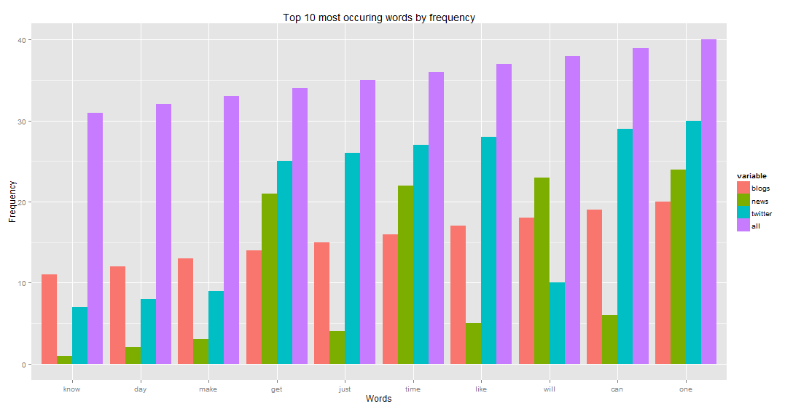
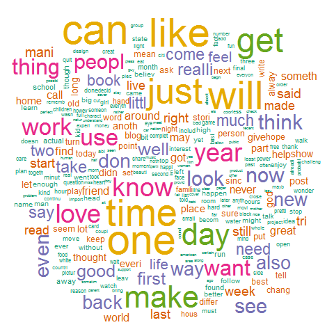
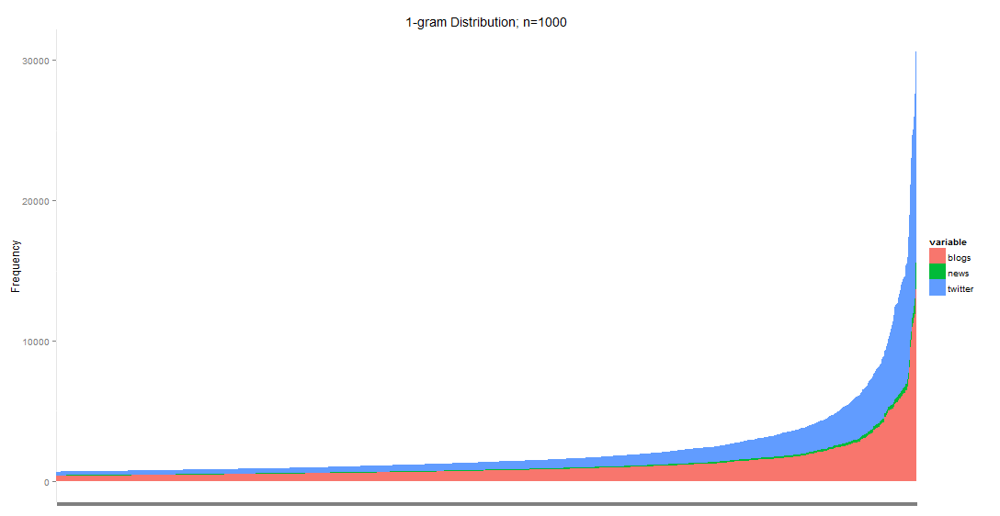
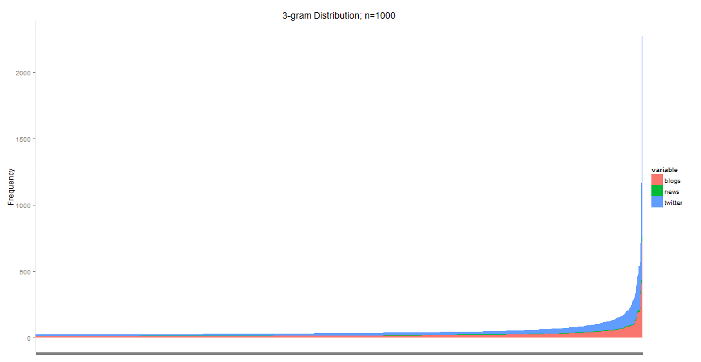

---
output:
  html_document: 
    theme: spacelab  
    highlight: tango
---

<center> <h1>Milestone Report: En Route to a Text Prediction Algorithm</h1> </center>
Author: Jovan Sardinha  
Email: jovan.sardinha@gmail.com  
Date: Thursday, December 24, 2015  

```{r libraries, echo = FALSE, message=FALSE, warning=FALSE}
library(xtable)
library(stargazer)
```

# Purpose and Objective

Around the world, mobile devices are becoming a bigger part of peoples lives. Nevertheless, typing on mobile devices still persists as a major pain point. [SwiftKey](http://swiftkey.com/en/) a leader in the predictive mobile text space has partnered with Coursera in their Data Science capstone to collaborate with participants of this program in building predictive text models like those used by SwiftKey.

The goal of the overall project is to:  
1. Build a predictive text model for the english language.  
2. Build a web application that utilizes a predictive text model to predict the next word given an input.  
3. Create a pitch deck that can be utilized to showcase the web application.  

The goal of this report is to:  
1. Perform preliminary analysis that will help in understanding the data set.   
2. Provide the next steps that will help devise the text prediction algorithm.    


# About the data

The data is from a corpus called [HC Corpora](www.corpora.heliohost.org). See the [readme file](http://www.corpora.heliohost.org/aboutcorpus.html) for details on the corpora available. The files have been language filtered but may still contain some foreign text.

## Pre-processing the data
The pre-processing steps used clean that data include:  
1. Removing URLs    
2. Removing twitter handles (ex. @JovanSardinha)    
3. Removing special character that are not part of the set [a-zA-Z0-9]  
4. Converting the corpus to lower case  
5. Removing punctuation  
6. Removing english stop words   
7. Removing white spaces  
8. Filtering profanity defined by [Banned Word List](http://www.bannedwordlist.com/) and [Front Gate Media](http://www.frontgatemedia.com/a-list-of-723-bad-words-to-blacklist-and-how-to-use-facebooks-moderation-tool/)  
9. Stemming the data

## Splitting the data
Given the large volume of data the following proportions were used to:

*For data exploration*  
 - Blog data: 10% of total blog corpus  
 - News data: 10% of total news corpus  
 - Twitter data: 10% of total twitter corpus  

*For predictive model analysis*

Training data set:     
 - Blog data: 60% of total blog corpus  
 - News data: 60% of total news corpus  
 - Twitter data: 60% of total twitter corpus  
 
Test data set:   
 - Blog data: 20% of total blog corpus  
 - News data: 20% of total news corpus  
 - Twitter data: 20% of total twitter corpus  
 
Cross-validation data set:    
 - Blog data: 20% of total blog corpus  
 - News data: 20% of total news corpus    
 - Twitter data: 20% of total twitter corpus  

*Note:* To split the data a uniform distribution random sampler was built and utilized.

The following table provides a summary of the data and its attributes:
```{r OverallStats,results='asis', echo=FALSE, fig.align='center'}
DataScource <- c("Blogs", "News", "Twitter")

TotalLines <- c("899,288", "77,259", "2,360,148")

LinesUsed <- c("89,929", "7,726", "236,019")

Sentences <- c("898,613", "19,190", "439,797")

Words <- c("11,807,363", "263,274", "2,802,311")

UniqueWords <- c("198,161", "4,668", "86,327")

Profanities <- c("3,887", "5", "6,101")

OverallStats <- data.frame(DataScource, TotalLines, LinesUsed, Sentences, Words, UniqueWords,  Profanities)
colnames( OverallStats ) <- c("Data Source", "Total Number of Lines", "Lines Used ", "Sentences", "Words", "Unique Words", "Profanities" ) 
xOverallStats <- xtable(OverallStats)
print(xOverallStats, type = "html", floating = FALSE, booktabs=TRUE, include.rownames=FALSE)
```

# Exploratory Analysis

Now that the texts have been split into words, it is possible to analyse the frequency of single words. The following figure shows the frequencies of the 10 most common words from each of the three sources. 

  

From this diagram we see that the the blogs and the twitter data sources have direct positive correlation for the top 10 most frequent words to the overall corpus. However, the news data sources shows some variability compared to the other two data sources.  



The word cloud show that most occurring words (shows by word size and colour) across the whole corpus adjusted. Common colloquial words such as [can, just, will, time, once] and so on, have the highest frequency.  

# N-Gram Analysis

Working with written text usually requires knowledge about the language used. For example, typical text mining work to remove stop words from texts or transform words into their stems, which clearly cannot be performed without knowing the underlying language. Therefore, modern text processing tools heavily rely on highly effective algorithms for language identification.

The key contribution was certainly the [Cavnar and Trenkle (1994)](http://odur.let.rug.nl/~vannoord/TextCat/textcat.pdf) paper on "n-Gram-Based Text Categorization", which suggested character n-gram frequencies as elements and the so-called out-of-place measure for comparing these.

The following three diagrams show the distribution of the n-Gram distributions for n in the set [1,2,3]. These diagrams illustrate that the as the n increases, the standard deviation decreases. Further steps in this project will study the exact relationship between these two properties.






# What to expect next?

1. Further cleaning procedures: Some of the exploratory analysis indicates that the base corpus could still use further cleaning functions to get rid of single character anomalies. Furthermore, testing functions that validate the cleanliness of the data should will also be built.

2. Modelling: This step involves thinking about efficiency storing the n-gram models created via Markov chains. Furthermore, steps and processes along the lines of feature selection and model validation will also be performed. Two key aspects namely, size (i.e. physical RAM and run-time) will be monitored and optimized during this step.

3. Prediction Algorithm development: In addition to building the model, evaluating the quality of predictions will also be taken into consideration. Things that will be given consideration here include inclusion of other data sets, n-gram model inefficiencies and model improving features.

